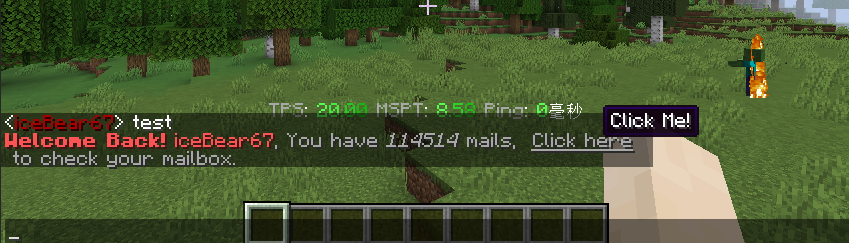

# Linguee

[Text](./api/src/main/java/io/ib67/bukkit/chat/Text.java) solution which is alternative to Adventure API.

Status: Beta (is going to be stable but needs more tests)

```java
TextThemes.DEFAULT = TextThemes.worldguard; // set theme
Text.of("**Welcome Back!** `{{papi:player_name}}`, You have *{{ mailcount }}* mails, ") // papi and your custom placeholders...
     .concat( // concatenating other texts.
             Text.of("[Click here](/kick {{papi:player_name}}) to check your mailbox.") // markdown-like syntax is supported, like [display](URL/Command) and *italic*
                .withClickAction(sender -> { // if the player clicks on the texts out of the "Click here"
                    Text.of("&cPlease click the underlined text, *don't click me!*").send(sender);
                    return true; // Sets this handler to expired and won't be called anymore.
                })
        ).send(player,Papi.IT.and(this::processMailCount).and(...)); // send to player with placeholder settings.
```


# Features

Linguee has a lot of features that help you to deal with texts.

## Texts are Colorful.

Linguee supports old-fashion chat color style in Minecraft.

`&a Green &b Aqua &c Red &r Reset ....`

we also support operators like `gradient`.

`&<gr:aqua-0xFFFF>Texts which are colored from aqua to red` (gradient colors are not supported yet... but RGB Colors like `&<1f1e33>` are supported..)

## In-Text DSL

Similar to Markdown.

`You can click this [link](/help) for help.` -> `You can click this &nlink&r for help.` (clickable, url is also
supported.)

``Use a `Sticky Wand` to attack them!`` -> `Use a &oSticky Wand&r to attack them!`

`*Sorry!* But you cannot build in *others' residences.` -> `&lSorry! &rBut you cannot build in &bothers' rediences.`

## Themed Texts

With a themed text, you can focus on what you want to emphasize to players instead of how to organize colors.

``Use a `Sticky Wand` to attack them!`` -> `Use a &oSticky Wand&r to attack them!`
-> `&bUse a &e&oSticky Wand&r&b to attack them!`

## Templates

You can put placeholders into your texts, with pollution-proof

`I think {{name}} is abusing his sword.` -> (With `{name = "&bnullcat_"}`) `I think &bnullcat_&r is abusing his sword.`

### Integrations

Placeholder API is also available, and you can inject your post-processors.

`Welcome back! {{papi:player_name}}` -> (With `{name = "nullcat_"}`) `Welcome back! nullcat_`
